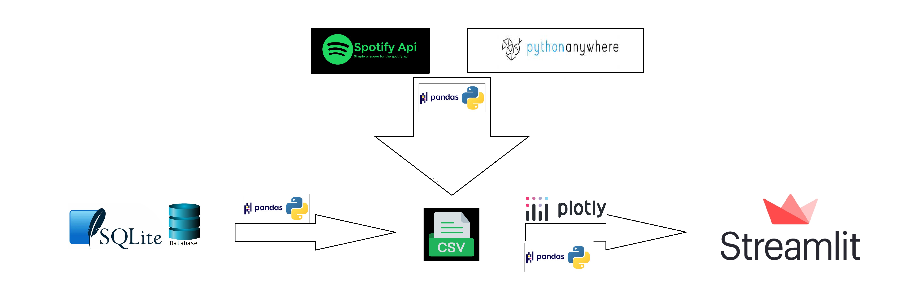

## Pink Floyd Interactive Dashboard with Daily Data Updates
Explore an interactive dashboard dedicated to the timeless music of Pink Floyd,
the greatest band of all time! Stay informed with daily data updates on popularity of tracks and albums, 
bringing you the latest information and insights for an enhanced experience.

### My workflow

I obtained data from a local SQLite database containing over 8 million Spotify tracks, which can be accessed at https://www.kaggle.com/datasets/maltegrosse/8-m-spotify-tracks-genre-audio-features?resource=download. I connected to the database using Python (pandas) and executed an SQL query to retrieve the desired data. Subsequently, I performed data cleaning to focus on the main Pink Floyd albums and tracks.

To ensure that my data remained up-to-date, I developed a Python script that made Spotify API calls. This allowed me to update the popularity data, which is frequently changing. To automate this task, I utilized the PythonAnywhere platform and scheduled daily runs of the script.

Finally, I built and deployed an interactive dashboard using Streamlit, leveraging the power of pandas and Plotly. This dashboard provides an engaging user interface for exploring the data.
